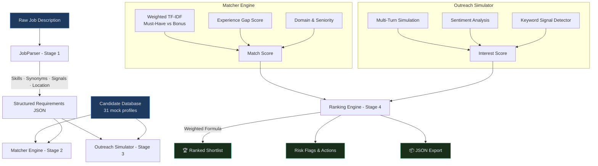

# 🎯 TalentPulse — AI-Powered Talent Scouting & Engagement Agent

> **Catalyst Hackathon 2025** | Built for [Deccan AI](https://github.com/hackathon-deccan-ai)

TalentPulse automates end-to-end recruiter workflows: paste a Job Description, and the agent discovers matching candidates, simulates conversational outreach, scores genuine interest via sentiment analysis, and delivers an **immediately actionable, ranked shortlist** — all without any external API calls.

---

## 🚀 Live Demo

> **[https://talentpulse.streamlit.app](https://talentpulse.streamlit.app)** *(deploy URL)*

---

## 📸 Screenshots

| Hero & JD Input | Parsed Skills | Quadrant Chart | Ranked Shortlist |
|---|---|---|---|
| Dark-mode premium UI | Categorised skill tags | Match vs Interest scatter | Gold-badge candidate cards |

---

## ✨ Features

| Feature | Description |
|---|---|
| **Stage 1: JD Understanding** | Extracts Must-Have/Good-to-Have skills, infers synonyms (e.g., FastAPI → Python), detects hidden urgency/culture signals, and parses location/work mode |
| **Stage 2: Discovery & Match** | TF-IDF weighted by Must-Have skills + domain alignment. Generates transparent 'Strengths' & 'Gaps' explainability for every candidate |
| **Stage 3: AI Engagement** | Simulates multi-turn conversations (outreach → response → follow-up → final reply). Calculates Interest Score based on entire interaction and generates conversation summaries |
| **Stage 4: Final Ranking** | Calculates final score, generates Recruiter Insights (Risk Flags & Action Recommendations), and exports a full structured JSON report |
| **Quadrant Visualization** | Interactive Plotly scatter: Match vs Interest, with quadrant shading to spot "hot leads" instantly |
| **Live Weight Control** | Sidebar sliders adjust Match/Interest weights — shortlist re-ranks in real time |
| **Filters** | Filter by location and experience range before running the agent |
| **JSON Export** | Download the full, structured JSON report of the job requirements and candidate rankings |

---

## 🏗 Architecture



---

## 📐 Scoring Logic

### Match Score (0–100)

```
Match Score = Skill_Similarity (0-70)
            + Experience_Score (0-20)
            + Seniority_Score  (0-10)
```

| Component | How it's calculated |
|---|---|
| **Skill Similarity** | TF-IDF vectorization of JD skills vs candidate skills, then cosine similarity (scaled 0–70) |
| **Experience Score** | 20 pts if candidate meets/exceeds required years; decremented 4 pts per year of gap |
| **Seniority Score** | 10 pts for exact seniority match; decremented 2 pts per level of gap |

### Interest Score (0–100)

```
Interest Score = Sentiment_Base (0-70)
              + Keyword_Bonus  (-20 to +20)
              + Subjectivity_Bonus (0-10)
```

| Component | How it's calculated |
|---|---|
| **Sentiment Base** | TextBlob polarity [-1, 1] mapped to [0, 70] |
| **Keyword Bonus** | +5 for each enthusiasm keyword ("excited", "ASAP", "love"); –8 for hesitation ("not looking", "pass") |
| **Subjectivity Bonus** | More expressive responses score higher (TextBlob subjectivity × 10) |

### Final Score

```
Final Score = (Match Score × w₁) + (Interest Score × w₂)
```

Default weights: **w₁ = 0.6, w₂ = 0.4** — adjustable in the sidebar.

---

## ⚙️ Setup Instructions

### Prerequisites
- Python 3.9+
- `pip`

### 1. Clone the repository
```bash
git clone https://github.com/<your-username>/talent-scout-agent.git
cd talent-scout-agent
```

### 2. Install dependencies
```bash
pip install -r requirements.txt
```

### 3. Regenerate the mock candidate database (optional)
```bash
python data.py
```

### 4. Run the app
```bash
streamlit run app.py
```

The app opens at `http://localhost:8501`.

---

## 📁 Project Structure

```
talent-scout-agent/
├── app.py              # Streamlit frontend (premium dark UI)
├── engine.py           # JobParser · Matcher · OutreachSimulator
├── data.py             # 31 mock candidate profiles generator
├── mock_candidates.csv # Generated candidate database
├── requirements.txt    # Python dependencies
└── README.md
```

---

## 🧪 Sample Input / Output

**Input JD:**
```
We are looking for a Senior Data Scientist with 5+ years of experience.
Must have: Python, Machine Learning, NLP, Pandas, Scikit-Learn.
Experience with PyTorch or deep learning is a plus.
```

**Extracted Requirements:**
- Skills: `python`, `machine learning`, `nlp`, `pandas`, `scikit-learn`, `deep learning`
- Experience: 5+ years
- Seniority: Senior
- Role Type: Data Scientist

**Top Ranked Output:**

| Rank | Name | Role | Match | Interest | Final |
|------|------|------|-------|----------|-------|
| #1 | Ravi Krishnamurthy | Senior Data Scientist | 82.4 | 88.0 | 84.7 |
| #2 | Amit Kumar | Data Scientist | 74.1 | 76.5 | 75.1 |
| #3 | Sneha Reddy | ML Engineer | 61.3 | 57.0 | 59.6 |

---

## 🛠 Tech Stack

| Layer | Technology |
|---|---|
| Frontend | Streamlit + Custom CSS (dark theme) |
| Visualization | Plotly (interactive scatter chart) |
| NLP / Matching | scikit-learn (TF-IDF + Cosine Similarity) |
| Sentiment Analysis | TextBlob |
| Data | Pandas + NumPy |
| Candidate Database | 31-profile mock CSV |

---

## 👤 Author

**Karthik** — Built for the Catalyst Hackathon 2025 by Deccan AI.
